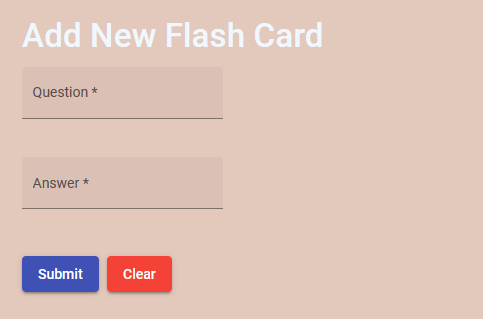
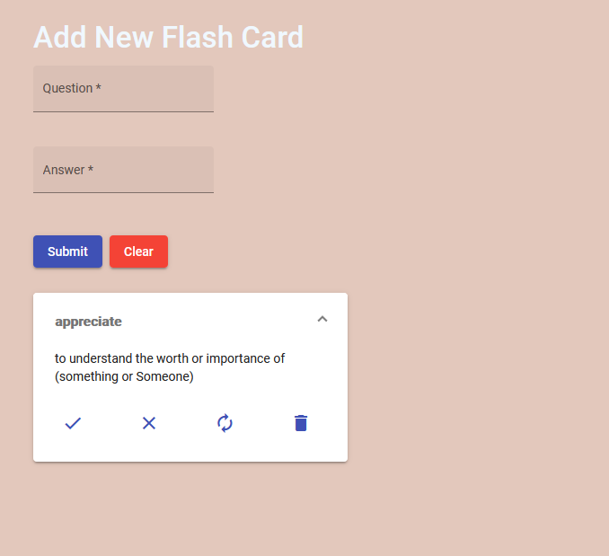
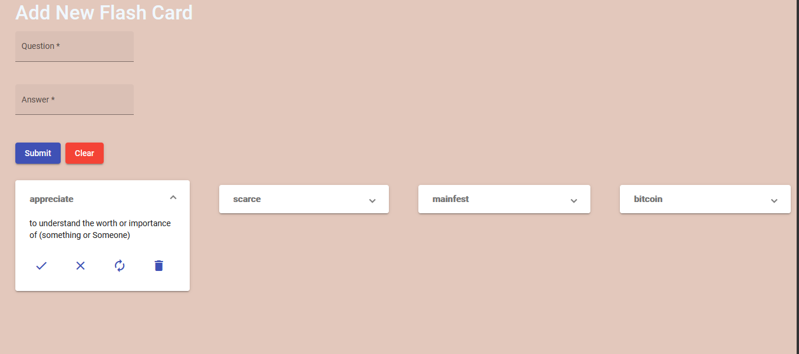
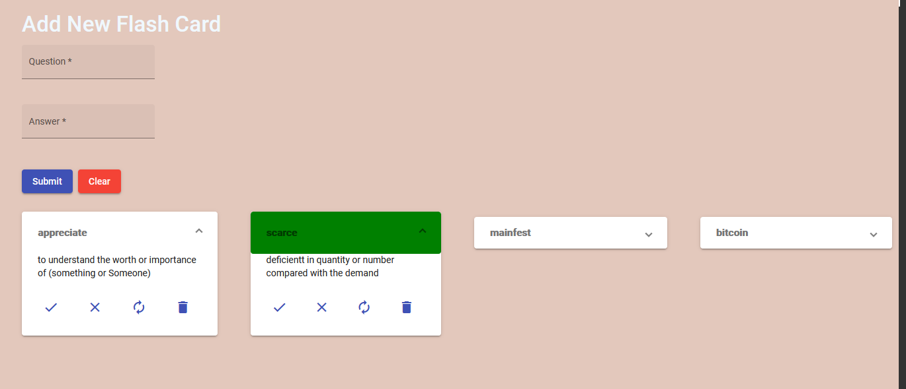
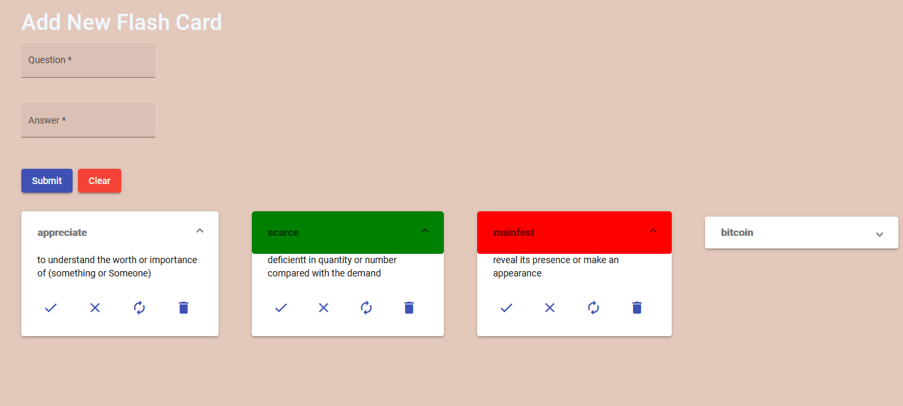

# Project : New Words Game
this is an Angular 10 project 
Main page user can add card in the list

     

#add one card in the list

     

#add four cards in the list

     

#On clicking tick icon, header turns green

     

#On clicking cross icon, header turns red

     

