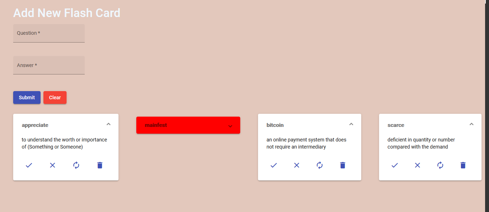
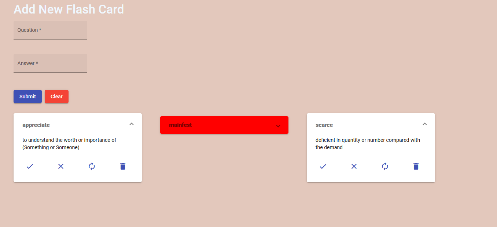
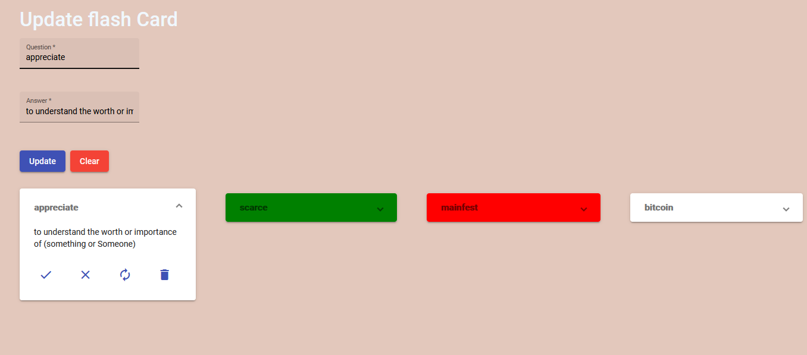
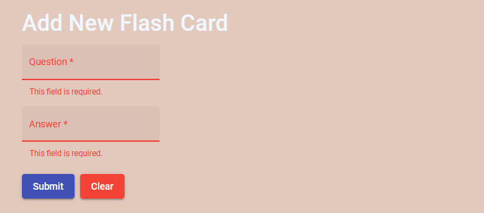

# Project : New Words Game
this is an Angular 10 project 
Main page user can add card in the list

     

#add one card in the list

     

#add four cards in the list

     

#On clicking tick icon, header turns green

     

#On clicking cross icon, header turns red

     

#before delete third card from the list

     

#After delete third card from the list

     

#On clicking edit, the form is populated and on submit card is updated
(optional bonus task)

     

#form validation 

     

